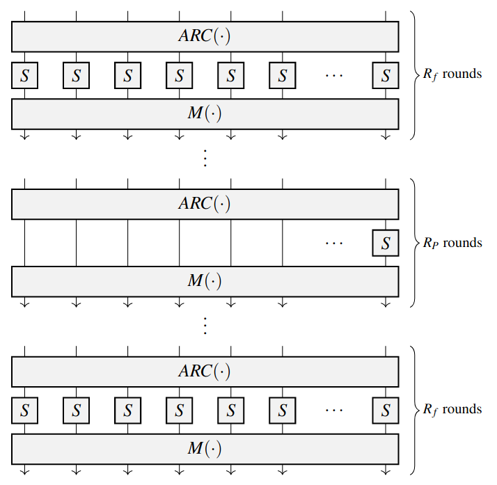

# StarkWare Poseidon

This crate implements the StarkWare Poseidon hash function. The chosen parameters can found [here](spec/poseidon3.txt), or directly from [StarkWare](https://github.com/starkware-industries/poseidon).

### Sagemath script
Check out [Sagemath script](/crates/stark_poseidon/poseidon.ipynb) for an easy overview and computed test vectors.

### Sponge construction
The hash function is a sponge construction as depicted below (image source, wikipedia) with rate $r=2$ and capacity $c=1$, i.e. total state width of $n=3$. Each entry is a finite field element of integers modulo $p=2^{251} + 17\cdot 2^{192} + 1$.

### Permutation
The function `f` in the above sponge is a permutation as specified by [Poseidon](https://eprint.iacr.org/2019/458.pdf). This is a standard [confusion and diffusion](https://en.wikipedia.org/wiki/Confusion_and_diffusion) construction, that saves work by working over $2R_f$ full rounds and $R_P$ partial rounds (in contrast to only full rounds, like AES or Rescue).

See the below illustration from the Poseidon paper.

For this construction, $R_f=4$ and $R_P=83$. Each round consists of:

- (ARC) AddRoundKey: Add fixed constants to the state.
- (S) SubWords: A non-linear function, here the cube $S(x)=x^3$.
- (M) MixLayer: Multiply with fixed matrix.

The difference between partial and full rounds is we only apply (S) to a single entry during the partial rounds - saving computation.

### Custom build script

This implementation compiles the [official](https://github.com/starkware-industries/poseidon) round constants to Rust code in `build.rs`.

This script converts a `.txt` file with integers in base 10 into our internal field element representation, which is four `u64`'s representing a field element in Big Endian. Furthermore, the field element is converted into internal [Montgomery](https://en.wikipedia.org/wiki/Montgomery_modular_multiplication) representation.

### Compressing round constants
We implement the naive variant using $n(R_f+R_P)=3(8+83)=273$ round constants, and an optimized variant using $n\cdot R_f + R_P=3\cdot 8 + 83 = 107$ constants.

The optimization stems from the fact that in partial rounds, the non-linear function SubWords is only applied to a single entry in each round, hence the other entries are only subject to linear functions, that can be can be combined/compressed to one. Those compressed partial roundkey are merged into the roundkeys used in the first of the last full rounds, and also the roundkeys subject to the non-linear function in the partial rounds except the first.

See `compress_roundkeys_partial(..)` in [`build.rs`](build.rs), for the algorithm.
